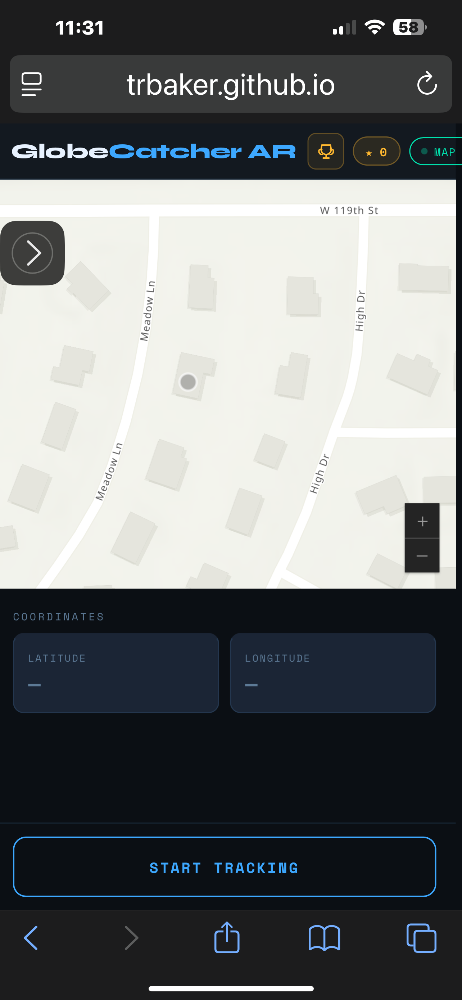

<a href="game.html">Game demo</a>

This is a mobile game that uses location to find AR objects within a defined area (like a hotel or convention center).  Here are some screen shots and explanation as to basic functionality as of June 1 2026.

This shows the start screen without tracking enabled.
  

User has enabled tracking - essentailly normal "hunting for globes" mode.
  

This images shows what a user sees after they have found and collected a globe.
  

This screen shows the "leader board" - a list of people who have found the most globes. In this screen, two usres are shown. Each user has collected one globe.
  

