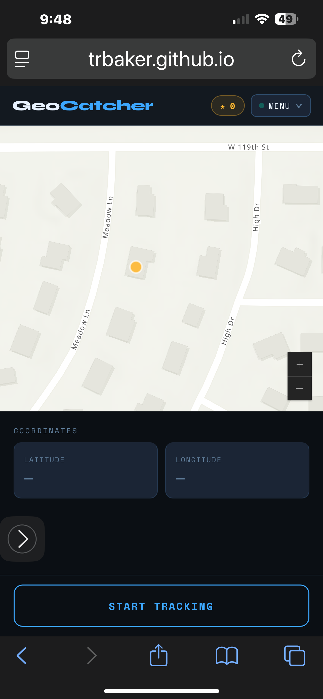
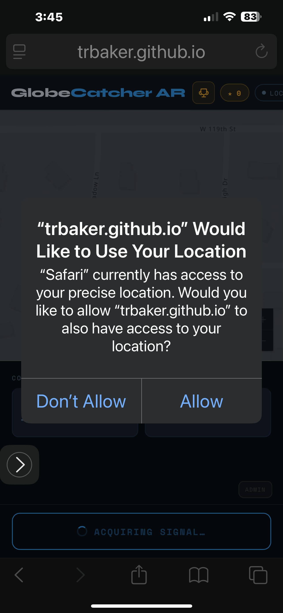
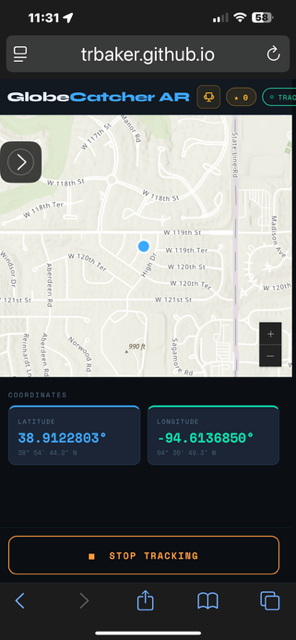
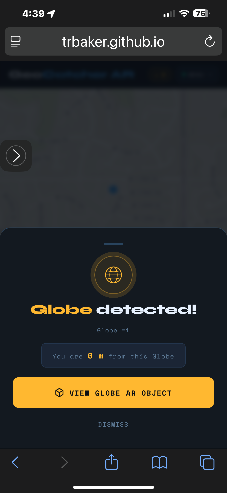
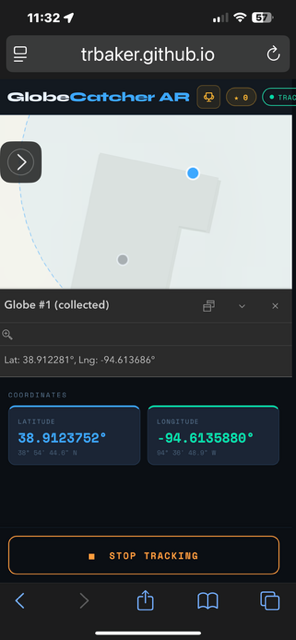
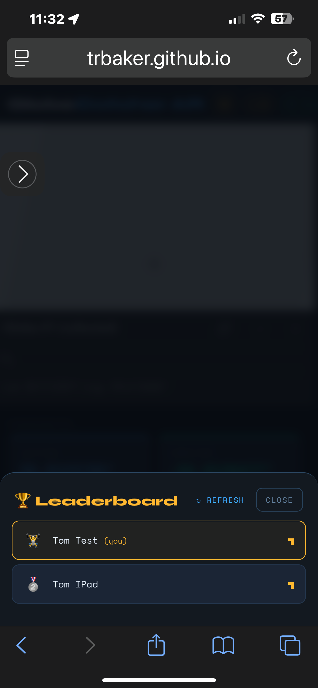

# GeoCatcher

Created by Tom Baker (tbaker@esri.com) of the Esri Education Team - using Claude.ai to "vibe-code". Neither Esri nor Tom are collecting any personally identifiable information in this app.  Your location data is used only in your browser and not reported back to Tom or Esri at any time. Location precision within the Marriott Marquis San Diego Marina is HIGHLY variable and may dramatically effect game play.

## Game overview

This game is experimental and offers no technical support. It is NOT an Esri software product.  

This is a mobile "geogame" that uses phone location services in the browser to find hidden AR (augmented reality) map markers within a defined area - like a hotel or convention center.  Players get within the geofence of the predefined markers to "catch" the marker and earn a point. Winners listed on the "Leaderboard" win only the respect and honor from fellow players.
 Screen shots and explanations follow.

## Start-up
 
This shows the start screen without tracking enabled. The gold dot shows the location of an active, uncollected map marker.
  

 
Requesting user approval to access location services - on iPhone.
  

 
User has enabled tracking - essentailly normal "hunting for globes" mode.  
Symbology:
<LI>blue dot is user position
<LI>gold dot with black border is active, an uncollected globe target
<LI>gray dot is a collected globe target
<LI>clear dot is an inactive globe target (will go gold at a later time during conference)
  

## Found globe

 
User enters geofence for a marker. Screen pops up.
  
 
When a user "finds" a marker.There are 30 markers - 11 are special markers. Each can be caught one time.
  
 
This is optionally what it looks like when a user opens the AR object (an interactive, pass-through display) - on iPhones.
  
 
This images shows what a user sees after they have caught a marker.
  

## Leaderboard
 
This screen shows the "leaderboard" - a list of people who have found the most markers. In this screen, two usres are shown. Each user has caught one marker.
  

